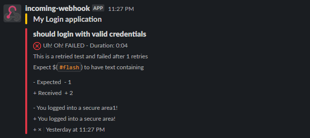

# wdio-slacknotify-service
Webdriverio library to send test results as a slack notification/message to channels

## Installation

The easiest way is to keep `wdio-slack-service` as a devDependency in your `package.json`.

```json
{
  "devDependencies": {
    "wdio-slack-service": "2.0.8"
  }
}
```

You can simple do it by:

```bash
npm install wdio-slack-service --save-dev
```

Instructions on how to install `WebdriverIO` can be found [here.](https://webdriver.io/docs/gettingstarted.html)

## Configuration

### Currently, this package supports `mocha` and `jasmine` frameworks only

At first, import the service to wdio config file `wdio.conf.js`

```js
// wdio.conf.js
const slack = require('wdio-slack-service');
```

In order to use the service you need to have slack webhook url to send the notification and you need to add `slack` to your `services` array

Example:

```js
// wdio.conf.js
export.config = {
    // ...
    services: [
        [slack, {
            webHookUrl: "<SLACK_WEBHOOK_URL>", // Used to post notification to a particular channel
            notifyOnlyOnFailure: true, // Send notification only on test failure
            messageTitle: "<NOTIFICATION_TITLE>" // Name of the notification
        }]
}
```

## Options

To send a notification, you should have slack webhook url. To know how to create slack webhook URL, see this [page](https://api.slack.com/messaging/webhooks)

### webHookUrl

This url is used to identity/authenticate the post message and sends it to a slack channel

Type: `String` <br/>
Optional: `NO` <br/>
Default: `NA`

### notifyOnlyOnFailure

If you want to receive slack notifications only on test failure, then set this option to `true`. Otherwise, it sends notification for all test executions irrespective of pass/fail

Type: `Boolean` <br/>
Optional: `YES` <br/>
Default: `false`

### messageTitle

Title of the notification

Type: `String` <br/>
Optional: `YES` <br/>
Default: `Webdriverio Slack Reporter`

## Screenshots

### All Pass


### Fail Pass


### Retry Failed



### Retry Passed


---

For more information on WebdriverIO see the [homepage](https://webdriver.io).